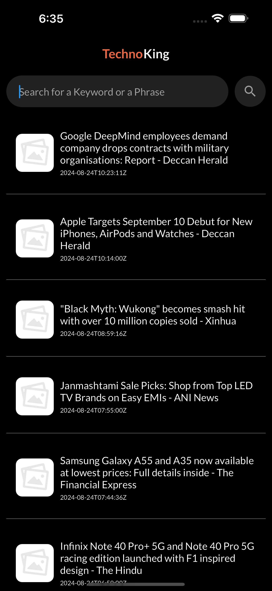

# Flutter News Application

## Overview

This Flutter news application provides a clean and modern dark-themed UI for accessing the latest news. It supports Android, iOS, web, and desktop platforms. The app fetches news from the NewsAPI and displays it in a list format. Users can tap on a news card to view the full-length article.

## Features

- **Cross-Platform Support**: Runs on Android, iOS, web, and desktop.
- **Dark UI Theme**: Elegant dark theme for a modern look.
- **News List**: Displays a list of the latest news from the NewsAPI.
- **Article Details**: Tapping a news card opens a detailed view with the full-length article.

## Getting Started

### Prerequisites

- Flutter SDK
- Dart
- An API key for the NewsAPI

### Installation

1. Clone the repository:

    ```bash
    git clone https://github.com/Vortex1806/techno_king_newsAPP.git
    ```

2. Navigate to the project directory:

    ```bash
    cd techno_king_newsAPP
    ```

3. Install dependencies:

    ```bash
    flutter pub get
    ```

4. Add your API key:

    - Open `lib/utils/key.dart`
    - Replace `YOUR_API_KEY` with your actual NewsAPI key in the static string `key`:

      ```dart
      class ApiKeys {
        static const String key = 'YOUR_API_KEY';
      }
      ```

5. Run the app:

    ```bash
    flutter run
    ```

### Screenshots





### Contributing

If you'd like to contribute to this project, please fork the repository and create a pull request. Make sure to follow the code style guidelines and write clear commit messages.

### License

This project is licensed under the MIT License - see the [LICENSE](LICENSE) file for details.

### Acknowledgments

- [Flutter](https://flutter.dev/) - Open-source UI framework
- [NewsAPI](https://newsapi.org/) - Provides news articles

## Contact

For any questions or feedback, please reach out to [shubhvora03@gmail.com].
